Инструкция по сборке конструктора Клевер 2
==========================================

Состав конструктора
-------------------

* Рама центральная x2.
* Рама дополнительная х4.
* Луч x8.
* Ножки x8.
* Защита для лучей x8.
* Защита пропеллеров x16.
* Защита боковая x16. 
* Пропеллер пластиковый Dalprop 5045 x4.
* Бесколлекторный электродвигатель Racerstar BR2205 2300kV x4.
* Регуляторы хода ESC, DYS XSD20А x4.
* Разъем силовой XT60 pin x1.
* Разъем силовой XT60 socket x1.
* Трехпроводной шлейф “мама-мама” x2.
* Провод медный многожильный с силиконовой изоляцией 14AWG (красный, черный), длина 50 см. 
* Плата распределения питания PDB BeeRotor Power Distribution Board V2.0 x1.
* Аккумуляторная батарея (АКБ) Li-ion 18650 x8.
* Зарядное устройство EFEST Luc V4 Li-lon x1.
* Защитный бокс регуляторов x4.
* Крепление под ножки x8.
* Полетный контроллер PIXHAWK x1.
* Радиоприемник FlySky i6 x1.
* Радиопульт FlySky i6 x1.
* Зарядное устройство EFEST LUC V4 x1.
* Провод Micro USB - USB x1
* Батарейный отсек 18650 li-Ion x1
* Провод медный многожильный с силиконовой изоляцией 18AWG (красный, черный), длина  100 см. 
* Батарейка АА х4
* Джампер, Bind-разъем

#### Крепежные элементы
* Пластиковые стойки 6 мм x28.
* Пластиковые стойки 30 мм x32.
* Винты М3x8 x48.
* Винты М3x12 x24.
* Винты М3x16 x40.
* Гайки Пластиковые x8.
* Гайки Металлические x48.
* Наклейки для отсека АКБ х8 .
* Термоусадка ф15 , .50 см
* Термоусадка ф5, 100 см
* Двухсторонний скотч 3M x16.
* Отвертка x1 (нужна визуализация)
* Изоляционная лента х1
* Ножницы канцелярские х1
* Ремешок для батареи 250 мм х1

Функционал радиопульта Flysky i6
---------------------------
1. Переключатель A (SwA).
2. Переключатель B (SwB).
3. Переключатель С (SwC).
4. Переключатель D (SwD).
5. Левый стик.
6. Правый стик.
7. Левый триммер.
8. Правый триммер.
9. Кнопка Вверх.
10. Кнопка Вниз.
11. Кнопка Ок.
12. Кнопка Отмены.
13. Кнопка BIND KEY.
14. Переключатель питания POWER.
15. ЖК-дисплей.
16. Ручка A (VrA).
17. Ручка B (VrB).

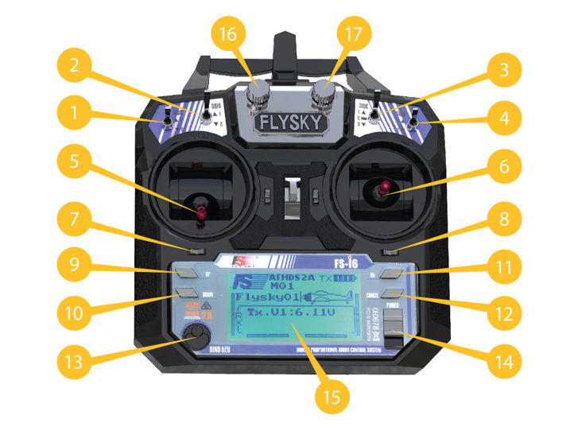

Дополнительное оборудование
---------------------------
#### Данное оборудование не входит в состав конструктора Клевер 2, но оно необходимо для реализации сборочного процесса 

1. Паяльник
2. Канифоль/ Флюс (нейтральный)
3. Припой
4. Фен промышленный
5. Плоскогубцы
6. Пинцет
7. Канцелярский нож
8. Мультиметр

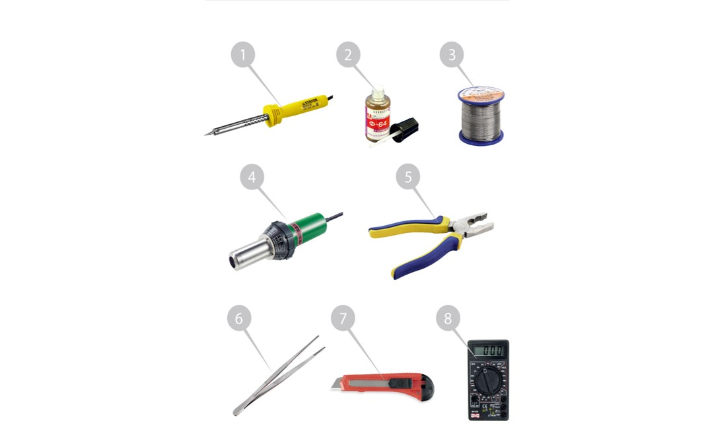
 

Порядок сборки
--------------

### Установка моторов

* Распаковать моторы. Используя плоскогубцы, укоротить провода на моторах, обрезать половину длины (оставив 25 мм).

Зачистить
* снять 2мм термоизоляции с конца провода не повредив медные жилы.

Скрутить провода.

Залудить
* Нанести флюс на оголенную часть провода. 
* Покрыть припоем, используя пинцет.

#### Закрепить мотор на луче

* Установить мотор на сторону луча с гравировкой.
* Прикрепить моторы к лучам винтами М3х8, используя отвертку.

* Лучи с моторами необходимо расположить согласно схеме. Стрелками указано направление вращения моторов.

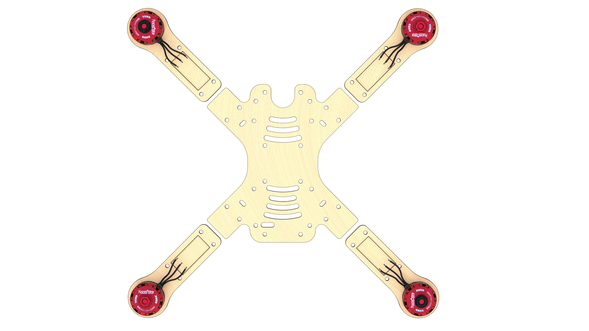
//указать стрелками направление вращения на моторах

#### Залудить три контактные площадки регулятора
* Нанести флюс 
* Нанести припой
Чтобы припой аккуратно заполнил всю площадку, необходимо прогреть площадку регулятора. Для этого нужно удерживать жало паяльника на контактной плащадке в течение 2 сек (или больше, если потребуется)

* Повторить данную операцию для оставшихся трех регуляторов

#### Припаять провода моторов к регуляторам
Припаять ранее приготовленные провода моторов к контактным площадкам регуляторов.

* Повторить данную операцию для оставшихся трех регуляторов

### Монтаж разъемов питания

#### Подготовка проводов для силовых разъемов XT60

1. Взять моток красных и черных проводов, промаркированных как 14AWG
2. Отрезать 4 куска провода следующей длины
* Длина 7 см (Для силового разъема XT60 pin) - 1 красный, 1 черный
* Длина 9 см (Для силового разъема XT60 socket) - 1 красный, 1 черный

#### Подготовка силовых разъемов питания XT60 pin и XT60 socket

1. Под разъем XT60 pin залудить два силовых провода красный и чёрный 14AWG длиной 7 см.
2. Залудить контактные площадки разъема XT60 pin.
3. Припаять черный провод к “-” контакту разъема.
4. Припаять красный провод к “+” контакту разъема .
5. Нарезать термоусадку ф5 (2 отрезка по 10 мм).
6. Надеть термоусадку ф5 на провода так, чтобы она закрывала контактные площадки проводов с XT60 .
7. Усадить термоусадку феном.

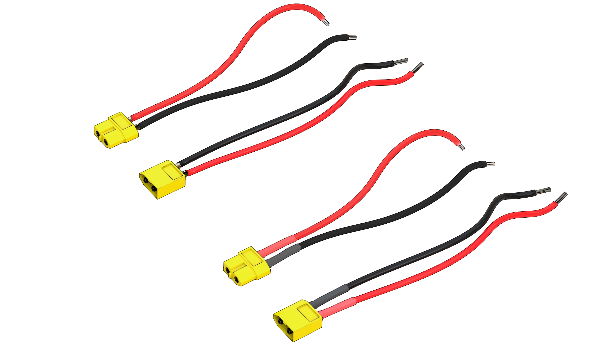

8. Повторить процедуру для разъема XT60 socket.

#### Подготовка разъема питания управляющей цепи 5В
 // *почему используется именно 3х контактный разъем, почему шина питания посередине

1. Обрезать/вытащить все пины из одного из разъемов. Отсоединить его.
2. Поддеть канцелярским ножом фиксатор на оставшемся разъеме, чтобы освободить 3-й провод.
3. Убрать 3-й (оранжевый) провод из разъема, за ненадобностью.
4. Длина оставшихся черного и красного проводов  10-12 см.

 *было бы круто, если делать такие картинки и в формате гифки

### Монтаж платы распределения питания

#### Предпаячная проверка

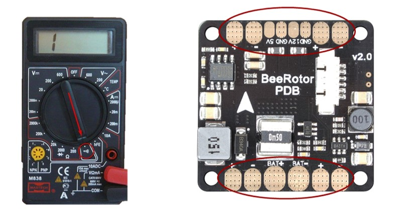

Прозвонить следующие цепи на НЕЗАМКНУТОСТЬ (отсутствие звукового сигнала мультиметра):
* “BAT+” и “BAT-” 
* “12V” и “GND”
* “5V” и “GND”

Прозвонить следующие цепи на ЗАМКНУТОСТЬ (появление звукового сигнала мультиметра):
* “BAT-” c каждым контактом, обозначенным “-” и “GND” 
* “BAT+”, с каждым контактом, обозначенным “+”

#### Залудить контактные площадки платы питания
1.  контактные площадки платы питания.
2. С помощью мультиметра проверить отсутствие контактного замыкания на плате (прозвонить)

Чтобы припой аккуратно заполнил всю площадку, необходимо её прогреть. Для этого нужно удерживать жало паяльника на контактной плащадке в течение 2 сек (или больше, если потребуется)

#### Пайка силового разъема питания XT60
Припаять разъем для АКБ, соблюдая полярность на контактных площадках.

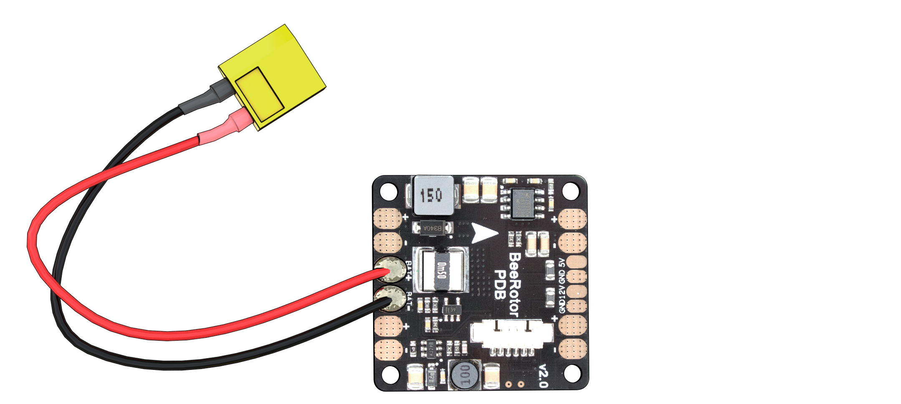

ВАЖНО о полярности
* красный провод - это “+”
* черный провод - это “-”

#### Пайка разъема питания управляющей цепи 5В
Припаять разъем 5В, соблюдая полярность на контактных площадках.
(на изображении: красный провод - это питание “+”)

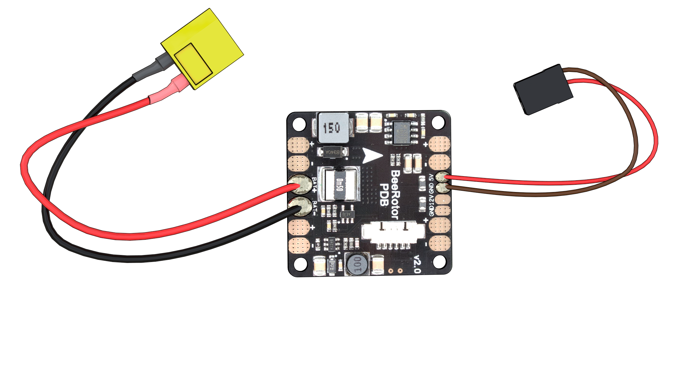

### Монтаж отсека АКБ

#### Подготовка перемычек (3 шт.)

* Отрезать силовой провод длиной 2 см.
* Зачистить с обеих сторон.
* Залудить.
* Сделать 3 перемычки
* Припаять перемычки по схеме.
* Прозвонить мультиметром. В случае необходимости зачистить наждачной бумагой.

#### Подготовка отсека АКБ
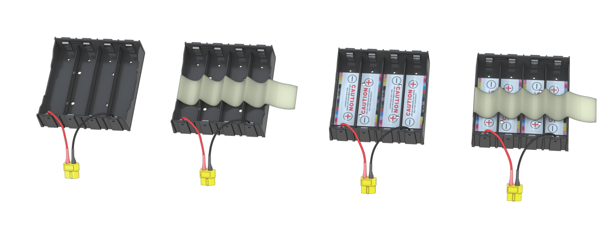
* Приклеить наклейки с разметкой внутрь отсека АКБ, в соответствии с полярностью.
* Приклеить ленту из скотча на дно отсека.

### Монтаж платы распределения питания

* Установить плату питания на раму винтами М3х8 и пластиковыми гайками.

* ВАЖНО
Стрелочка на плате направлена в сторону носового выреза

#### Монтаж элементов

1. Установить гайки в пластиковые держатели

2. Установить лучи на раму винтами М3х16
*Лучи устанавливаются поверх рамы 
*Пластиковые держатели устанавливаются снизу рамы
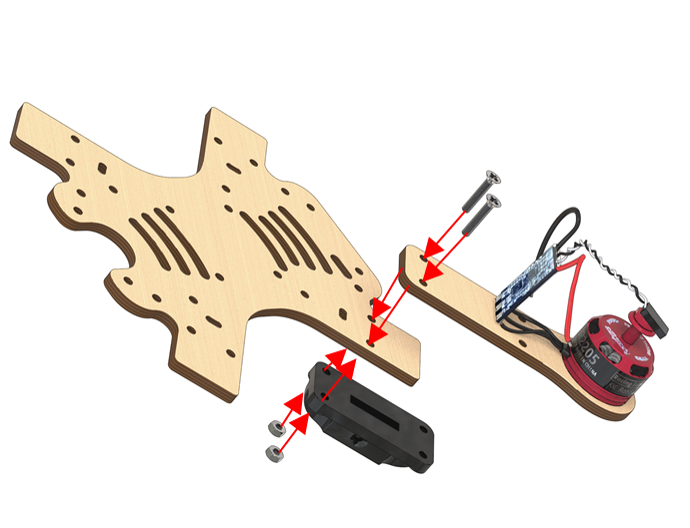

3. Расположение моторов
Проверить расположение моторов (моторы с черной гайкой в левом верхнем углу и в правом нижнем).

4. Продеть силовые провода регуляторов в отверстия.
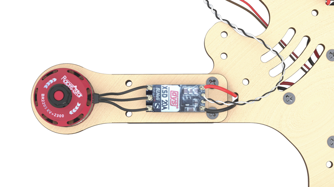

#### Пайка силовой цепи платы питания
Припаять силовые провода регуляторов к плате питания, соблюдая полярность.
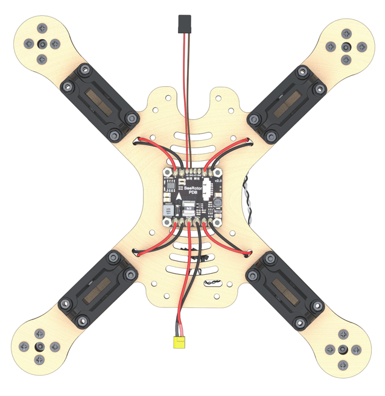

ВАЖНО о полярности
*красный провод - это “+”
*черный провод - это “-”

### Сопряжение приемника и пульта
1. Подключить радиоприемник к разъему 5В. В любой разъем, GND внизу. На схеме питание обозначено как 5V
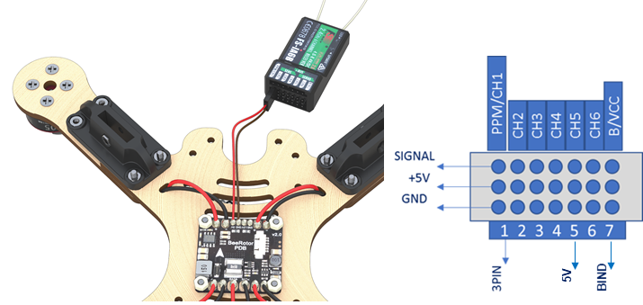
3. Подключить АКБ.
Светодиод на радиоприемнике должен мигать.

#### БЕЗОПАСНОСТЬ при работе с АКБ

#### Включение радиопульта
1. На пульте зажать кнопку BIND KEY.
2. Включить пульт (перещелкнуть POWER, BIND KEY не отпускаем).
3. Ждем синхронизацию.
4. Отсоединить джампер.
5. Светодиод горит непрерывно.

### Проверка направления вращения моторов
1. Наклеить наклейки на АКБ 18650.
2. Установить 18650 в отсек АКБ, соблюдая полярность.

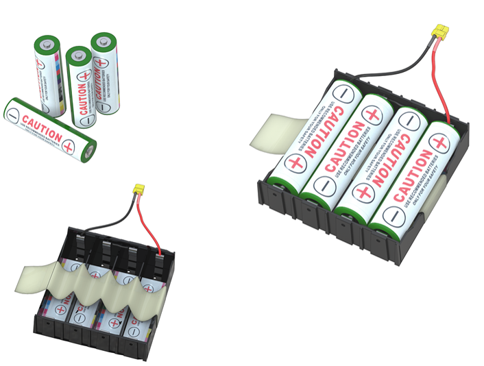

3. Проверить, что разъем питания 5В подключен к приемнику по схеме.
4. Подключить регулятор мотора к 3 каналу приемника CH3 по схеме.
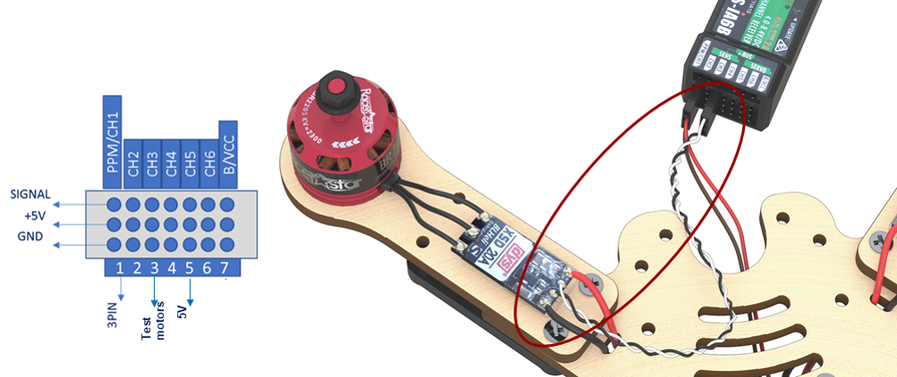

5. Подключить внешнее питание (АКБ).
6. Включить пульт.
7. Подать левым стиком газ (throttle) на 10%.
8. Проверить направления вращения мотора по схеме.
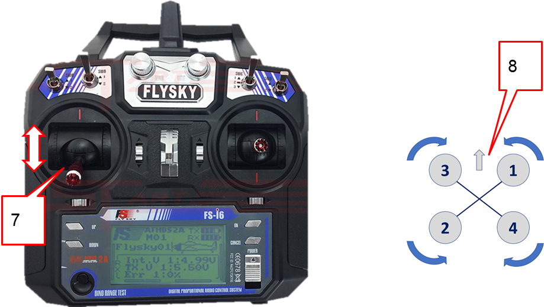

9. Если необходимо изменить направление вращения, то меняем любые два фазных провода мотора (нужно перепаять).

### Монтаж радиоприемника
1. Установить пластиковые стойки 30 мм на раму винтами М3х8.
2. Разъем питания 5В продеть в прорезь.

3. Приемник прикрепить к , используя двухсторонний скотч и ориентируясь на гравировку. Антенны направлены вперед. 

 

4. Установить 3х проводной шлейф в канал PPM / CH1.

5. Продеть в прорезь к разъему 5 В.
6. Прикрутить нижнюю дополнительную раму к стойкам на центральной раме винтами М3х8. 

##### ВАЖНО
Направление стрелок на плате питания и на раме дополнительной совпадают

### Монтаж полетного контроллера
#### Переворачиваем сборку

#### Установка полетного контроллера Pixhawk
1. Клеим 2х сторонний скотч по углам полетного контроллера 
 

##### ВАЖНО
При работе моторов возникают вибрации, отрицательно влияющие на показания датчиков полетного контроллера Pixhawk. Чтобы избежать этого эффекта, количество слоев двустороннего скотча
лучше увеличить до 4-5.

2. Установить  полетный контроллер в центр рамы

 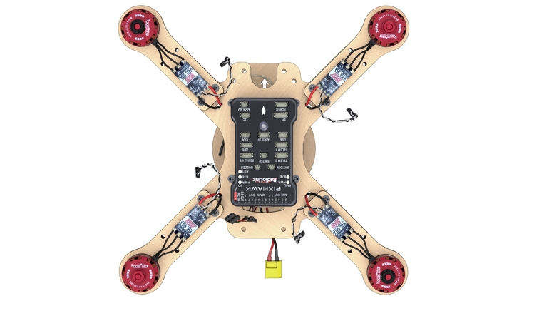
##### ВАЖНО
Стрелки на раме и pixhawk должны быть сонаправлены

#### Подключение полетного контроллера по схеме

1. PPM (трехпроводной шлейф) подключить к порту RCIN
2. Моторы к 1,2,3,4 портам MAIN OUT, согласно схеме
3. Питание от PDB (5В/VCC) в любой порт, кроме SB (SBUS)

 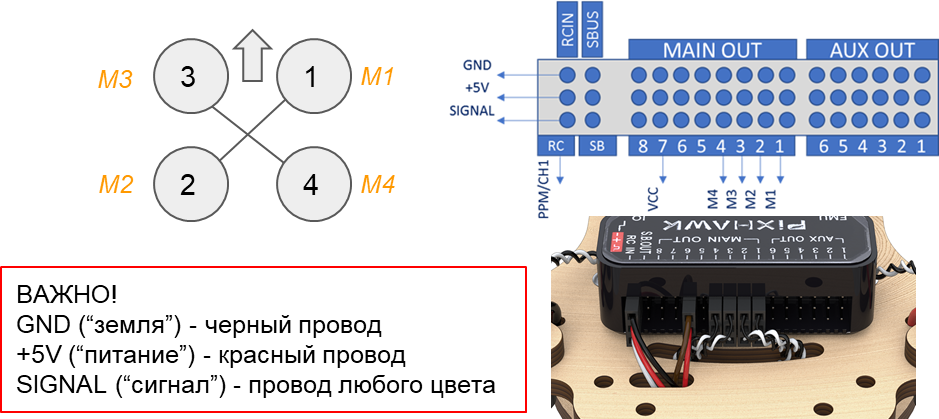

### Сборка регуляторов
1. Клеим 2х сторонний скотч на основание защитного бокса регуляторов

2. Укладываем регуляторы в защитные боксы. Крепим полученную сборку к лучам рамы.

### Установка защиты
1. Закрепить нижнюю защиту винтами М3х16 на лучах рамы

2. Закрепить ножки к пластиковым держателям винтами М3х16

3. Закрепить стойки 30 мм в отверстия нижней защиты винтами М3х12
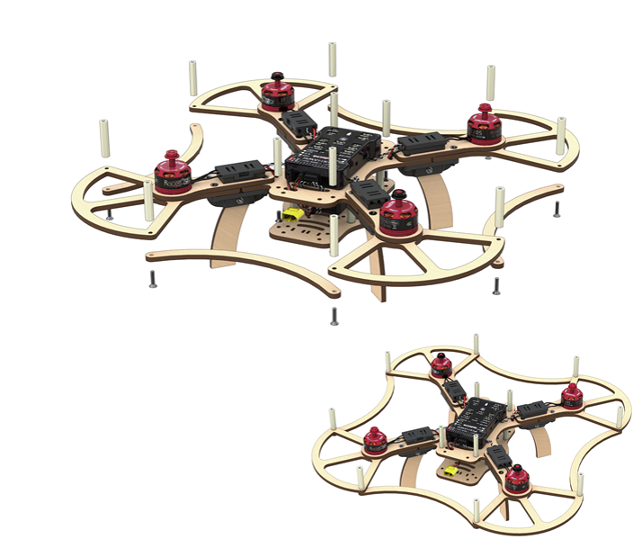

4. Закрепить верхнюю защиту винтами М3х12

### Монтаж отсека АКБ

Необходимые компоненты
* Винты М3х12 (4 шт)
* Гайки М3 (4 шт)
* Рама дополнительная (1 шт)
* Батарейный отсек (1 шт)

1. Прикрепить батарейный отсек на верхнюю дополнительную раму винтами М3х12 и гайками.

2. Прикрепить верхнюю дополнительную раму на стойки винтами М3х8.

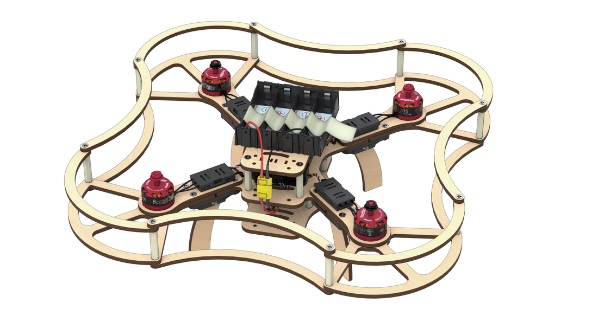

3. Установить АКБ в отсек.

### Монтаж антенн

1. Крепим антенны на 2х сторонний скотч или изоленту, а усики продеваем в передние отверстия верхней дополнительной рамы.

Коптер готов к настройке!

## БЕЗОПАСНОСТЬ ПРИ СБОРКЕ И НАСТРОЙКЕ

1. Снять пропеллеры.“Все наземные операции производить со снятыми пропеллерами. Устанавливать пропеллеры на моторы только перед полётом.”

2. Отключить аккумулятор. Держать питание выключенным.
“Сборку, настройку и ремонт производить с отключенным питанием. Подключать питание только для тестирования электронных компонентов коптера. После тестирования перед другими работами питание сразу отключить.”

3. Позвать на помощь
“Если при выполнении работ возникли какие-либо проблемы, необходимо обратиться к преподавателю или учителю, а не пытаться решить проблему самостоятельно.”

## Безопасность при работе с Li-ion аккумуляторами 18650

1. Обращаться с аккумуляторами бережно. Не допускать падений, ударов деформаций. 
2. При подключении (отключении) аккумуляторов держаться только за разъёмы, тянуть или дергать за провода запрещается.
3. В случае обрыва разъемов, обнаружения нарушений целостности изоляции или корпуса аккумулятора, не трогая его, немедленно сообщить преподавателю.

## БЕЗОПАСНОСТЬ ПРИ ЛЁТНОЙ ЭКСПЛУАТАЦИИ КОПТЕРОВ

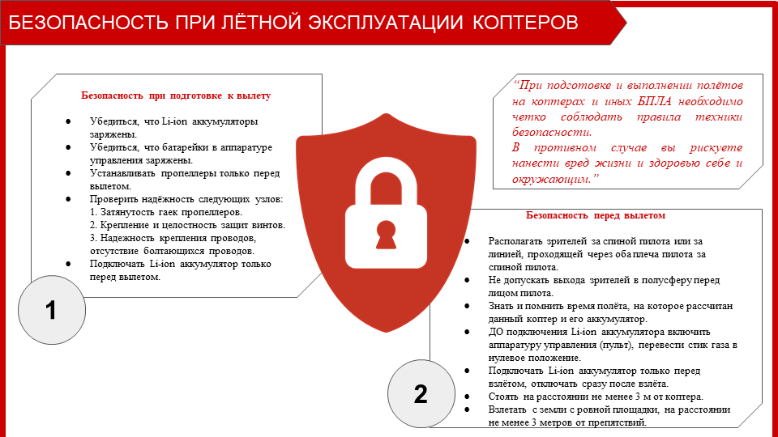

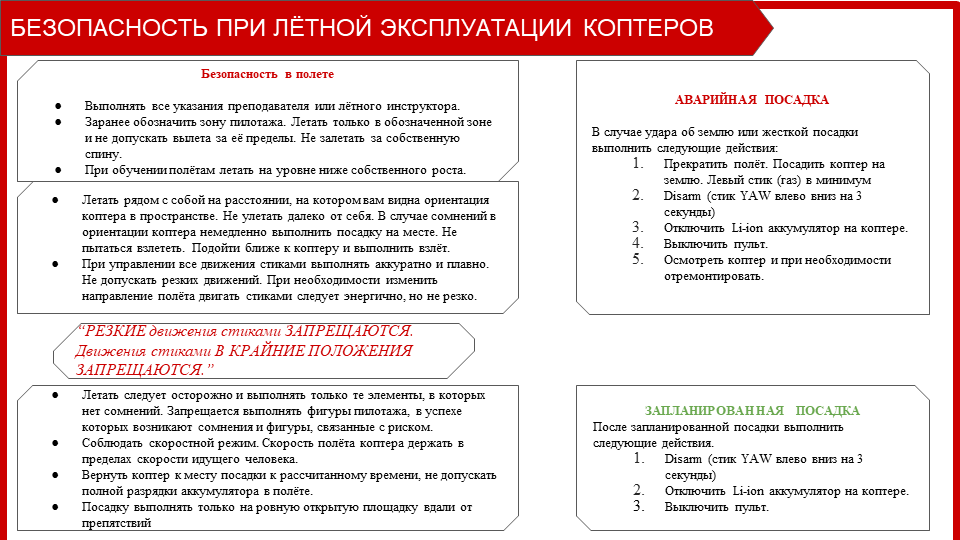
