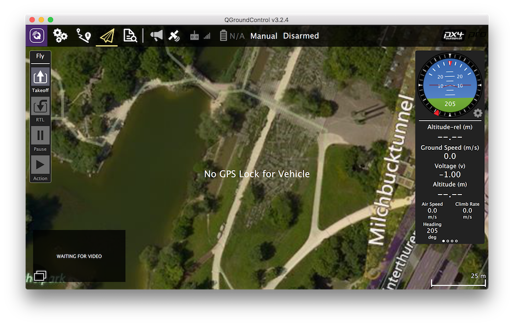

Использование QGroundControl через Wi-Fi
===

Возможен контроль, управление и настройка полетного контроллера квадрокоптера с помощью программы QGroundControl по Wi-Fi.
Для этого необходимо подключиться к Wi-Fi сети `CLEVER-xxxx`.

После чего в launch-файле Клевера `/home/pi/catkin_ws/src/clever/clever/launch/clever.launch` выбрать один из преднастроенных режимов: TCP, UDP, UDP-B.

После изменения launch-файла необходимо перезагрузить сервис clever:

```(bash)
sudo systemctl restart clever
```

Подробнее о возможных настройках `gcs_bridge` [на сайте пакета mavros](http://wiki.ros.org/mavros#Connection_URL).

TCP-бридж
---

Изменить параметр gcs_bridge в launch-файле:
```xml
<arg name="gcs_bridge" default="tcp"/>
```

Затем в программе QGroundControl нужно выбрать Application Settings -> Comm Links -> Add. Создать подключение со следующими настройками:


Затем необходимо выбрать в списке подключений "Clever" и нажать "Connect".

UDP-бридж
---

Изменить параметр gcs_bridge в launch-файле:
```xml
<arg name="gcs_bridge" default="udp"/>
```

Затем в программе QGroundControl нужно выбрать Application Settings -> Comm Links -> Add. Создать подключение со следующими настройками:


Затем необходимо выбрать в списке подключений "CLEVER" и нажать "Connect".

UDP broadcast-бридж
---

Для использования UDP broadcast-бриджа необходимо установить параметр `gcs_bridge` в значение `udp-b`:

```xml
<arg name="gcs_bridge" default="udp-b"/>
```

При использовании UDB broadcast-бриджа достаточно подключиться к Wi-Fi сети Клевера. QGroundControl должен подключиться к коптеру автоматически.

> **Note** UDP broadcast-бридж работает быстрее, чем TCP-бридж, но связь в нем менее стабильная: иногда могут возникать проблемы при загрузке миссии на коптер, а также при калибровке сенсоров.

___
После успешного подключения можно настраивать, калибровать и просматривать состояние квадкоптера без проводов.

