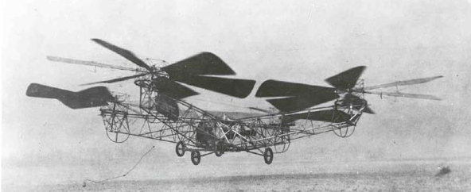
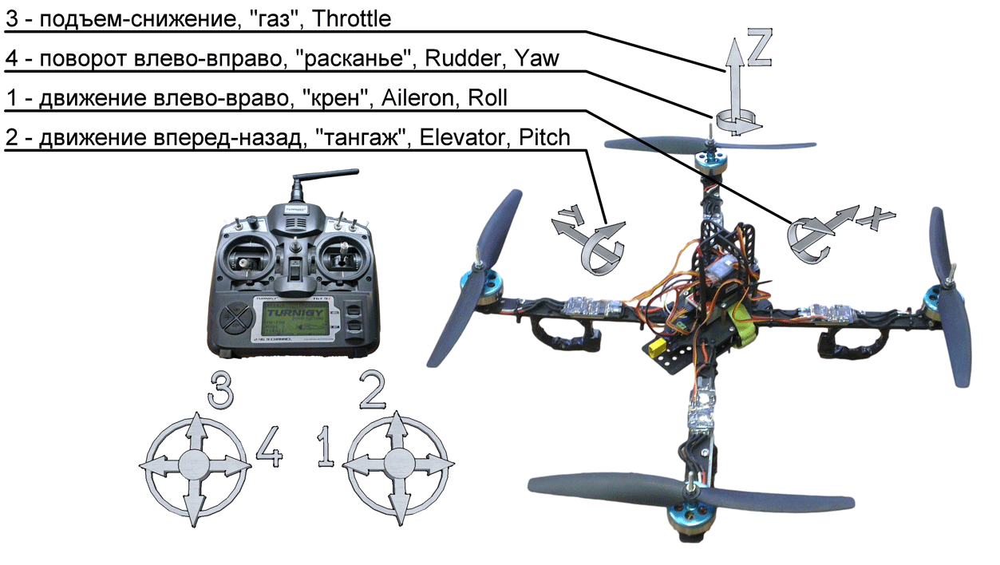
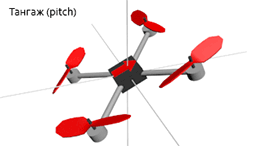
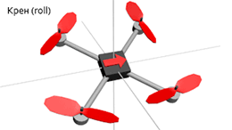
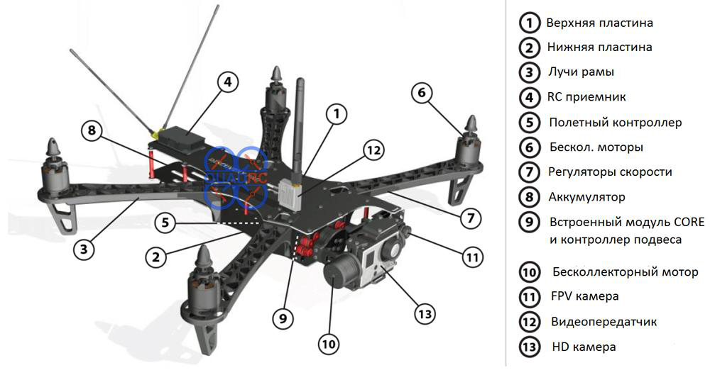
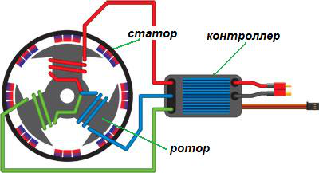

Урок №1: «Знакомство. Принципы проектирования и строение мультикоптеров»
========================================================================

Первые беспилотники
-------------------

Толчком к появлению дистанционно управляемых машин стало открытие электричества и изобретение радио. Австрийская армия использовала управляемые по проводам воздушные шары для бомбардировки Венеции 22 августа 1849 года. В 1892 году компания «Электрические торпеды Симса-Эдисона» представила управляемую по проводам противокорабельную торпеду. В 1897 году британец Эрнест Уилсон запатентовал систему для беспроводного управления дирижаблем, но сведений о постройке такого механизма нет.

В 1899 году на выставке в Мэдисон-Сквер-Гарден инженер и изобретатель Никола Тесла продемонстрировал миниатюрное радиоуправляемое судно. Несмотря на то, что общественность в первую очередь заинтересовало военное применение его изобретения, сам Тесла указывал на потенциально гораздо более широкое применение дистанционного управления (названного изобретателем «телеавтоматикой»), например, в человекоподобных автоматонах.

### «Жук» Кеттеринга 

Экспериментальная беспилотная «воздушная торпеда», один из первых проектов предшественников современных крылатых ракет. Разработана изобретателем Чарльзом Кеттерингом по заказу Армии США в 1917 году. Предназначалась для обстрела с дистанции до 120 км городов, крупных промышленных центров и мест сосредоточения войск противника. Отличался простотой конструкции и очень низкой ценой. Хотя аппарат сравнительно успешно прошёл испытания, Первая мировая война закончилась и снаряд так и остался опытным.

### Вертолёт Ботезата

Многовинтовые вертолёты разрабатывались ещё в первые годы вертолётостроения. Один из первых квадрокоптеров (англ. quadcopter, четырёхроторный вертолет), который реально оторвался от земли и мог держаться в воздухе, был создан Георгием Ботезатом и испытан в 1922 году. Недостатком этих аппаратов была сложная трансмиссия, передававшая вращение одного мотора на несколько винтов. Изобретение хвостового винта и автомата перекоса положило конец этим попыткам. Новые разработки начались в 1950-е годы, но дальше прототипов дело не продвинулось.

Применение коптеров
-------------------

Беспилотный летательный аппарат (БПЛА) - летательный аппарат, 
выполняющий полет без пилота (экипажа) на борту и управляемый в полете 
автоматически, оператором с пункта управления или сочетанием указанных 
способов. Имеет широкое применение в различных сферах: 

* Телекоммуникационная сфера (использование двусторонней видео/аудио связи); 

* Транспортная сфера (транспортировка грузов); 

* Спасательные работы (исследование труднодоступных зон при 
стихийных бедствиях, терактах, поиск находящихся под завалами людей, транспортировка медикаментов, оказание первой помощи при 
несчастных случаях); 

* Рекламные кампании (применение робота для привлечения внимания на крупных выставках и т.п.); 

* Сфера СМИ (аэросъемка различных событий);  

* Видео/фото-съёмка (съёмка фильмов или рекламных роликов с 
высоты птичьего полёта);

* Продовольственная сфера (доставка продуктов питания). 

Виды и конфигурация
-------------------

Есть множество способов конфигурации двигателей: трикоптер, 
гексакоптер, октокоптер, но самый простой из них в сборке и управлении, это квадрокоптер, то есть мультироторная платформа с четырьмя двигателями. В 
свою очередь квадрокоптер может иметь + и х конфигрурацию. У «+»-коптера 
один из лучей направлен вперед, у «х»-платформ основное направление 
находится между двумя соседними лучами.

Управление
----------

Управление коптером осуществляется при помощи пульта управления, который передает команды радиоприемнику. Пульт питается от батареек, а радиоприемник получает питание от Полетного контроллера. Связь зачастую односторонняя, только от пульта к приемнику. Приемник подключается к полетному контроллеру минимум пятью проводами, по которым передаются сигналы поворота вокруг трех осей, команда «газа» и полетный режим.

**Throttle** — переводится как «дроссель», «тяга» или «газ» в обиходе. Газ мультикоптера — среднее арифметическое между скоростями вращения всех моторов. Чем больше газ, тем больше суммарная тяга моторов, и тем сильнее они тащат коптер вверх (проще говоря «Тапок в пол» здесь означает наискорейший подъем). Обычно измеряется в процентах: 0% — моторы остановлены, 100% — вращаются с максимальной скоростью. Газ висения — минимальный уровень газа, который необходим, чтобы коптер не терял высоту.

Оси коптера: углы тангажа, крена и рыскания (pitch, roll, yaw) — углы, которыми принято определять и задавать ориентацию мультикоптера в пространстве.

**Yaw** – «рыскание». Поворот носа мультикоптера. условно - вращение вправо влево.

**Pitch** - «тангаж». В коптерах манипуляции с этим моментом силы позволяет коптеру двигаться вперед или назад за счет наклона носа в соответствующем направлении. 

**Roll** - «крен». Наклон мультикоптера влево вправо. Коптер за счет крена может двигаться боком в соответствующую сторону.

Газ, тангаж, крен, рыскание — если вы можете управлять этими четырьмя параметрами, значит вы можете управлять квадрокоптером. Их еще иногда называют каналами управления. Режимов полета существует много. Используется и GPS, и барометр, и дальномер, так же режим стабилизации (stab, stabilize, летать в «стабе»), в котором квадрокоптер держит те углы, которые ему задаются с пульта не зависимо от внешних факторов. В этом режиме при отсутствии ветра квадрокоптер может висеть почти на месте. Ветер же придется компенсировать пилоту.
Направление вращения винтов выбирается не случайно. Если бы все моторы вращались в одну сторону, квадрокоптер вращался бы в противоположную из-за создаваемых моментов. Поэтому одна пара противостоящих моторов всегда вращается в одну сторону, а другая пара — в другую. Эффект возникновения моментов вращения используется, чтобы изменять угол рыскания: одна пара моторов начинает вращаться чуть быстрее другой, и вот уже квадрокоптер медленно поворачивается к нам лицом:

  LFW — left front clockwise rotation (левый передний, вращение по часовой стрелке)
  
  RFC — right front counter clockwise rotation (правый передний, вращение против часовой стрелке)
  
  LBC — left back counter clockwise rotation (левый задний, вращение против часовой стрелке)
  
  RBW — right back clockwise rotation (правый задний, вращение по часовой стрелке)
  
  
  
Элементы коптера
----------------

Как правило, когда речь заходит об управлении моделью катера или самолёта, оператор имеет абсолютный, точный контроль над работой мотора. Нажатие на джойстик пульта приводит к пропорциональному увеличению скорости вращения винтов (в об./мин). Отличие многовинтовых летательных аппаратов (вне зависимости от того, достоинство это или недостаток) в том, что ни один человек не в состоянии одновременно контролировать скорость вращения трёх и более моторов достаточно точно, чтобы сохранять баланс аппарата в воздухе.
Именно здесь в игру вступают Полетные контроллеры.

**Полетный контроллер** - самая важная часть. Стабильность полета и управляемость на девяносто процентов зависит от способностей полетного контроллера.
Задача полетного контроллера — переводить команды от пульта управления в сигналы задающие обороты двигателя. Также в нем установлены инерциальные измерительные датчики, позволяющие следить за текущим положением платформы и выполнять автоматические регулировки. 

**ESC** — это регуляторы оборотов электродвигателей. Дело в том, что в мультикоптерах используют специальные бесколлекторные электродвигатели, которые способны работать на очень больших оборотах. Для управления этими двигателями необходимо формировать трехфазное напряжение и относительно большие токи, чем и занимаются регуляторы оборотов. Для каждого двигателя необходим свой регулятор оборотов. Все регулятора оборотов подключаются к полетному контроллеру. Питаются регуляторы непосредственно от аккумулятора. Каждый двигатель подключен к своему регулятору оборотов тремя проводами. Последовательность подключения проводов определяет направление вращения двигателя.

**Электродвигатель**

В конструкциях коптеров используются бесколлекторные электродвигатели. Они обладают выдающимися характеристиками и живучестью в связи с отсутствием трущихся узлов (щеток) посредством которых передается ток. В отличие от обычного электродвигателя, у которого имеется подвижная часть - ротор и неподвижная - статор, у бесколлекторного двигателя подвижной частью является как раз статор с постоянными магнитами, а неподвижной частью - ротор с обмотками трех фаз. Для того, чтобы заставить вращаться такую систему, необходимо осуществлять в определенном порядке смену направления магнитного поля в обмотках ротора - тогда постоянные магниты статора будут взаимодействовать с магнитными полями ротора и подвижный статор прийдет в движение. Это движение основано на свойстве магнитов с одноименными полюсами  полюсами отталкиваться, а с противоположными - притягиваться.

**Аппаратура радиоуправления** 

Представляет собой передатчик с пультом и приемник. Отличаются друг от друга количеством каналов и частотой. Большинство передатчиков имеют частоту 2,4ГГц, так же на рынке представлен ряд других частот. 

**Пропеллер** - лопасть, приводимая во вращение двигателем и предназначенная для преобразования мощности (крутящего момента) двигателя в тягу. Лопасти винта, вращаясь, захватывают воздух и отбрасывают его в направлении, противоположном движению. Перед винтом создаётся зона пониженного давления, за винтом - повышенного. Таким образом создается подъемная сила.
Воздушный винт имеет следующие характеристики:

1. Диаметр;

2. Шаг винта - одна из основных технических характеристик воздушного или гребного винта, зависящая от угла установки его лопастей относительно плоскости вращения при их круговом движении в газовой или жидкостной среде — это расстояние, пройденное поступательно винтом, ввинчивающимся в твёрдую среду, за один полный оборот (360°);

3. Материал.

### Аккумулятор 

Питает регуляторы и полетный контроллер. В строительстве коптеров применяют специализированные литий-полимерные аккумуляторы. 
Основные характеристики аккумулятора:

* Емкость (мА*ч);

* Максимальный токоразряд (20С);

* Количество банок (2S,3S, 4S);

* Вес.

### Силовая рама 

Изготавливается, как правило, из пластика или композитных материалов.

### Контрольные вопросы:

1. В какое время появился первый квадрокоптер, и в чём был его недостаток?
2. В каких сферах можно использовать коптеры?
3. Какие конфигурации квадрокоптеров бывают?
4. Перечислите название осей коптера.
5. По какому принципу вращаются винты коптера?
6. За что отвечает полётный контроллер?
7. Для чего нужен ESC?
8. Какой вид электродвигателей применяется в коптерах? В чём их преимущество?
9. Какими тремя параметрами обладают воздушные винты?
10. Может ли квадрокоптер летать в вакууме? 
