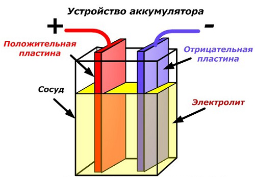
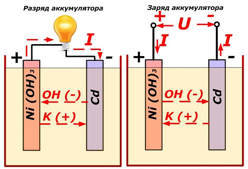
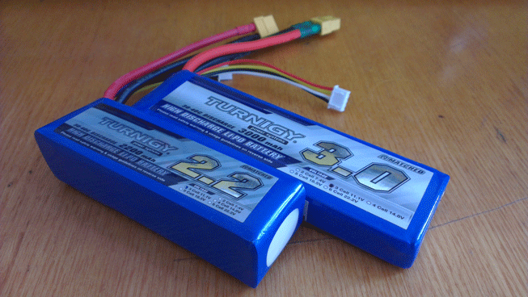
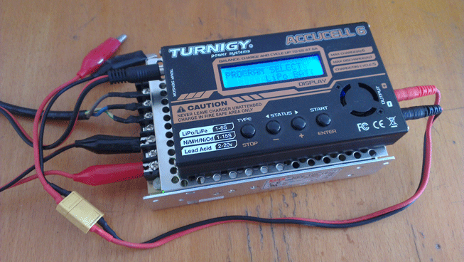
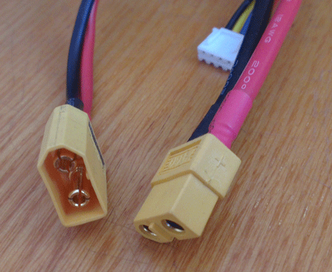

Урок №11: «Принцип работы, типы и устройство аккумуляторов»
===========================================================

Как устроены и работают аккумуляторы
------------------------------------

В широком смысле слова в технике под термином «Аккумулятор» понимается устройство, которое позволяет при одних условиях эксплуатации накапливать определенный вид энергии, а при других — расходовать ее для нужд человека.
Их применяют там, где необходимо собрать энергию за определенное время, а затем использовать ее для совершения больших трудоемких процессов. Например, гидравлические аккумуляторы, используемые в шлюзах, позволяют поднимать корабли на новый уровень русла реки.
Электрические аккумуляторы работают с электроэнергией по этому же принципу: вначале накапливают (аккумулируют) электричество от внешнего источника заряда, а затем отдают его подключенным потребителям для совершения работы. По своей природе они относятся к химическим источникам тока, способным совершать много раз периодические циклы разряда и заряда.
Во время работы постоянно происходят химические реакции между компонентами электродных пластин с заполняющим их веществом — электролитом.
Принципиальную схему устройства аккумулятора можно представить рисунком упрощенного вида, когда в корпус сосуда вставлены две пластины из разнородных металлов с выводами для обеспечения электрических контактов. Между пластинами залит электролит. 

 
Работа аккумулятора при разряде
-------------------------------

Когда к электродам подключена нагрузка, например, лампочка, то создается замкнутая электрическая цепь, через которую протекает ток разряда. Он формируется движением электронов в металлических частях и анионов с катионами в электролите.

Этот процесс условно показан на схеме с никель-кадмиевой конструкцией электродов. 

Здесь в качестве материала положительного электрода используют окислы никеля с добавками графита, которые повышают электрическую проводимость. Металлом отрицательного электрода работает губчатый кадмий.
Во время разряда частицы активного кислорода из окислов никеля выделяются в электролит и направляются на отрицательные пластины, где окисляют кадмий.

При отключенной нагрузке на клеммы пластин подается постоянное (в определенных ситуациях пульсирующее) напряжение большей величины, чем у заряжаемого аккумулятора с той же полярностью, когда плюсовые и минусовые клеммы источника и потребителя совпадают.
Зарядное устройство всегда обладает большей мощностью, которая «подавляет» оставшуюся в аккумуляторе энергию и создает электрический ток с направлением, противоположным разряду. В результате внутренние химические процессы между электродами и электролитом изменяются. Например, на банке с никель кадмиевыми пластинами положительный электрод обогащается кислородом, а отрицательный — восстанавливается до состояния чистого кадмия.
При разряде и заряде аккумулятора происходит изменение химического состава материала пластин (электродов), а электролита не меняется.

Способы соединения аккумуляторов
--------------------------------

### Параллельное соединение

Величина тока разряда, которую может выдержать одна банка, зависит от многих факторов, но в первую очередь от конструкции, примененных материалов и их габаритов. Чем значительнее площадь пластин у электродов, тем больший ток они могут выдерживать.
Этот принцип используется для параллельного подключения однотипных банок у аккумуляторов при необходимости увеличения тока на нагрузку. Но для заряда такой конструкции потребуется поднимать мощность источника. Этот способ используется редко для готовых конструкций, ведь сейчас намного проще сразу приобрести необходимый аккумулятор. Но им пользуются производители кислотных АКБ, соединяя различные пластины в единые блоки.

### Последовательное соединение

В зависимости от применяемых материалов, между двумя электродными пластинами распространенных в быту аккумуляторов может быть выработано напряжение 1,2/1,5 или 2,0 вольта. (На самом деле этот диапазон значительно шире.) Для многих электрических приборов его явно недостаточно. Поэтому однотипные аккумуляторы подключают последовательно, причем это часто делают в едином корпусе.

Особенности аккумуляторов для коптеров
--------------------------------------

Двигатели квадрокоптера в зависимости от размера могут потреблять значительные токи. Основным требованием к аккумуляторам является высокая токоотдача. И наилучшими характеристиками с этой точки зрения обладают литий-полимерные аккумуляторы.  

### Характеристики LiPo аккумуляторов

**Емкость.** Записывается в ампер-часах. Это такой ток который до полного разряда может выдавать аккумулятор в течении часа. Например, если емкость аккумулятора 3А/ч, то значит он может в течении одного часа выдавать ток 3А. При токе 1А его хватит на 3 часа, а при токе 30А он разрядится за 6 минут.

**Максимальный разрядный ток.** Указывается во сколько максимальный разрядный ток превышает емкость. Например значение «30-40C» для аккумулятора с емкостью 3А/ч означает, что он кратковременно может выдавать ток 90-120А. Естественно, при выборе аккумулятора необходимо руководствоваться меньшим значением.

**Напряжение.** Зависит от количества «банок» или ячеек аккумулятора. Напряжение одной ячейки LiPo аккумулятора составляет порядка 3,7В. Соответственно, чем больше ячеек, тем больше напряжение. Соединяя аккумуляторы последовательно можно набрать достаточно большое напряжение, как это делают, например, в электровелосипедах.
Кроме перечисленных достоинств LiPo-аккумуляторы обладают низким саморазрядом. К недостаткам можно отнести не самую высокую плотность заряда, малое количество рабочих циклов и пожароопасность. Кроме того для заряда LiPo-аккумуляторов, состоящих из нескольких ячеек необходимо применять специальные зарядные устройства, обеспечивающие равномерный заряд ячеек.

Зарядка LiPo-аккумуляторов
--------------------------

Для зарядки используется  специальное зарядное устройство. Практически все модели питаются не от сети, а от постоянного напряжения 12В.

Особенность этого зарядного устройства в том, что он умеет делать балансировку ячеек аккумулятора. То есть аккумулятор подключается к нему не только силовым разъемом, но и дополнительным балансировочным разъемом на который выведены все ячейки по отдельности. Это дает возможность заряжать все ячейки равномерно, что дает одинаковое распределение нагрузки на банки аккумулятора в процессе эксплуатации.

Применение LiPo-аккумуляторов
-----------------------------

Для подключения аккумуляторов используют специальные коннекторы. Диаметр пистонов в них 4мм и они дополнительно подпружинены для обеспечения большой площади контакта. Еще для подключения используют специальные провода в силиконовой изоляции, которая способна выдерживать высокие температуры.

 
Меры предосторожности
---------------------

На YouTube можно найти много видео о том, что произойдет, если проколоть LiPo-аккумулятор. Если вы не хотите, чтобы после неудачного падения аккумулятор «заживо» сжег весь коптер обязательно надо позаботиться о механической защите батареи. Например, можно купить для своего аккумулятора специальную оболочку из силикона.

### Контрольные вопросы:

1)	Какие устройства называют аккумуляторами?
2)	За счёт каких процессов в аккумуляторе накапливается энергия?
3)	Что происходит в аккумуляторе во время его заряде и разряде? 
4)	Опишите два способа соединения аккумуляторов.
5)	Какие аккумуляторы применяются при сборке коптеров?
6)	Перечислите основные характеристики аккумуляторов.
