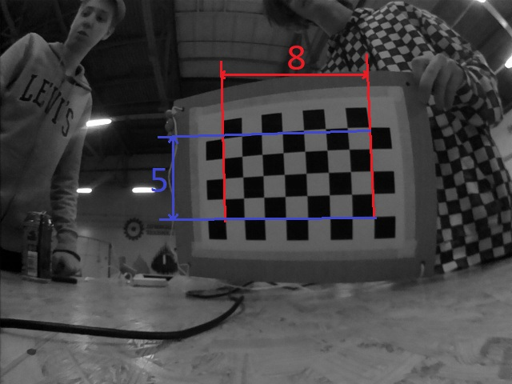
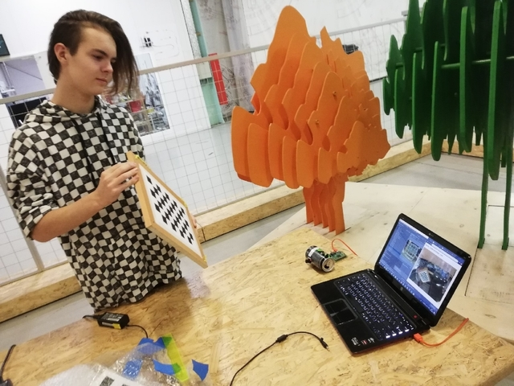
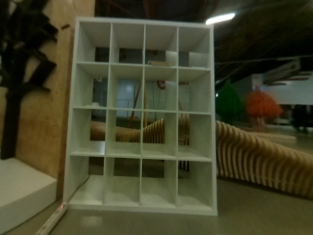
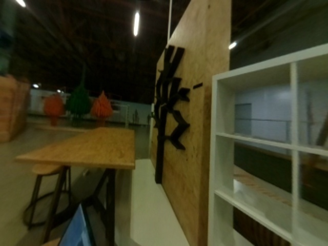
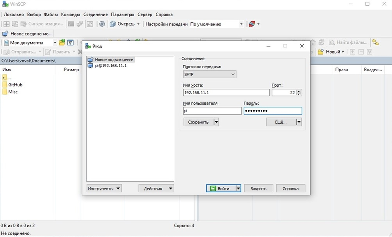
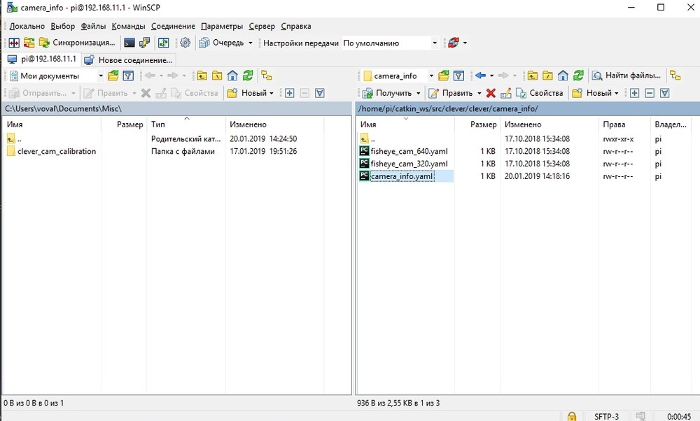
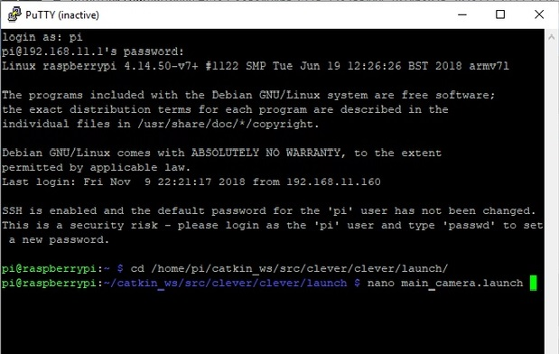

# Калибровка камеры

Компьютерное зрение получает все более широкое распространение. Зачастую, алгоритмы компьютерного зрения работают неточно, получая искаженное изображение с камеры, что особенно характерно для fisheye-камер.


> Изображение "скруглено" ближе к краям.

Какой-либо алгоритм компьютерного зрения будет воспринимать информацию с этой картинки неправильно. Для устранения подобных искажений камера, получающая изображения, должна быть откалибрована в соответствии со своими особенностями.

## Установка скрипта

Для начала, необходимо установить необходимые библиотеки:

```
pip install numpy
pip install opencv-python
pip install glob
pip install pyyaml
pip install urllib.request
```

Затем скачиваем скрипт из репозитория:

```bash
git clone https://github.com/tinderad/clever_cam_calibration.git
```

Переходим в скачанную папку и устанавливаем скрипт:

```bash
cd clever_cam_calibration
sudo python setup.py build
sudo python setup.py install
```

Если вы используете Windows, тогда скачайте архив из [репозитория](https://github.com/tinderad/clever_cam_calibration/archive/master.zip), распакуйте его и установите:

```bash
cd path\to\archive\clever_cam_calibration\
python setup.py build
python setup.py install
```

> path\to\archive - путь до распакованного архива.

## Подготовка к калибровке

Вам необходимо подготовить калибровочную мишень. Она представляет собой «шахматную доску». Файл можно взять [отсюда](https://www.oreilly.com/library/view/learning-opencv-3/9781491937983/assets/lcv3_ac01.png).
Наклейте распечатанную мишень на любую твердую поверхность. Посчитайте количество пересечений в длину и в ширину доски, измерьте размер клетки (в мм).



Включите Клевер и подключитесь к его Wi-Fi.

> Перейдите на 192.168.11.1:8080 и проверьте, получает ли компьютер изображения из топика image_raw.

## Калибровка

Запустите скрипт **_calibrate_cam_**:

**Windows:**

 ```bash
>path\to\python\Scripts\calibrate_cam.exe
```

> path\to\Python - путь до директории Python

**Linux:**

```bash
>calibrate_cam
```

Задайте параметры доски:

```bash
>calibrate_cam
Chessboard width:  # Перекрестий в ширину
Chessboard height:  # Перекрестий в длину
Square size:  # Длина ребра клетки (в мм)
Saving mode (YES - on):  # Режим сохранения
```

> Режим сохранения: если включен, то все полученные фотографии будут сохраняться в нынешней директории.

Скрипт начнет свою работу:

```
Calibration started!
Commands:
help, catch (key: Enter), delete, restart, stop, finish
```

Чтобы откалибровать камеру, вам требуется сделать как минимум 25 фото шахматной доски с различных ракурсов.



Чтобы сделать фото, введите команду **_catch_**.

```bash
>catch
```

Программа будет информировать вас о состоянии калибровки.

```bash
...
Chessboard not found, now 0 (25 required)
>  # Enter
---
Image added, now 1 (25 required)
```

> Вместо того, чтобы каждый раз вводить команду **_catch_**, Вы можете просто нажимать клавишу **_Enter_** (вводить пустую строку).

После того, как будет набрано достаточное количество изображений, введите команду **_finish_**.

```bash
...
>finish
Calibration successful!
```

**Калибровка по существующим изображениям:**

Если же у вас уже есть изображения, то вы можете откалибровать камеру по ним при помощи скрипта **_calibrate_cam_ex_**.

```bash
>calibrate_cam_ex
```

Указываем характеристики мишени, а так же путь до папки с изображениями:

```bash
>calibrate_cam_ex
Chessboard width:  # Перекрестий в ширину
Chessboard height:  # Перекрестий в длину
Square size:  # Длина ребра клетки (в мм)
Path:  # Путь до папки с изображениями
```

В остальном этот скрипт работает аналогично **_calibrate_cam_**.

Программа обработает все полученные фотографии, и создаст файл **_camera_info_****_._****_yaml_** в нынешней директории. При помощи этого файла можно будет выравнивать искажения на изображениях, полученных с этой камеры.

> Если вы поменяете разрешение получаемого изображения, вам нужно будет снова калибровать камеру.

## Исправление искажений

За получение исправленного изображения отвечает функция **_get_undistorted_image(cv2_image, camera_info)_**:

* **_cv2_image_**: Закодированное в массив cv2 изображение.
* **_camera_****_­__****_info_**: Путь до файла калибровки.

Функция возвращает массив cv2, в котором закодировано исправленное изображение.

> Если вы используете fisheye-камеру, поставляемую вместе с Клевером, то для обработки изображений разрешением 320x240 или 640x480 вы можете использовать уже существующие параметры калибровки. Для этого в качестве аргумента **_camera_info_** передайте параметры **_clever_cam_calibration.clevercamcalib.CLEVER_FISHEYE_CAM_320_** или **_clever_cam_calibration.clevercamcalib.CLEVER_FISHEYE_CAM_640_** соответственно.

## Примеры работы

Изначальные изображения:


Иcправленные изображения:





## Пример использования

**Обработка потока изображений с камеры**.

Данная программа получает изображения с камеры Клевера и выводит их на экран в исправленном виде, используя существующий калибровочный файл.

```python
import clevercamcalib.clevercamcalib as ccc
import cv2
import urllib.request
import numpy as np
while True:
	req = urllib.request.urlopen('http://192.168.11.1:8080/snapshot?topic=/main_camera/image_raw')
    arr = np.asarray(bytearray(req.read()), dtype=np.uint8)
    image = cv2.imdecode(arr, -1)
    undistorted_img = ccc.get_undistorted_image(image, ccc.CLEVER_FISHEYE_CAM_640)
    cv2.imshow("undistort", undistorted_img)
    cv2.waitKey(33)
cv2.destroyAllWindows()
```

## Использование для ArUco

Чтобы применить параметры калибровки к системе ArUco-навигации, требуется перенести калибровочный .yaml файл на Raspberry Pi Клевера и инициализировать его.

> Не забудьте подключиться к WiFI Клевера.

Для передачи файла используется протокол SFTP. В данном примере используется программа WinSCP.

Подключимся к Raspberry Pi по SFTP:

> Пароль: _**raspberry**_



Нажимаем “Войти”. Переходим в _**/home/pi/catkin_ws/src/clever/clever/camera_info/**_ и копируем туда калибровочный .yaml файл:



Теперь мы должны выбрать этот файл в конфигурации ArUco. Для этого используется связь по протоколу SSH. В данном примере используется программа PuTTY.

Подключимся к Raspberry Pi по SSH:


Войдем под логином _**pi**_ и паролем _**raspberry**_, перейдем в директорию _**/home/pi/catkin_ws/src/clever/clever/launch**_ и начнем редактировать конфигурацию _**main_camera.launch**_:



В строке _**camera node**_ заменим параметр _**camera_info**_ на _**camera_info.yaml**_:


> Не забудьте изменить разрешение камеры.
