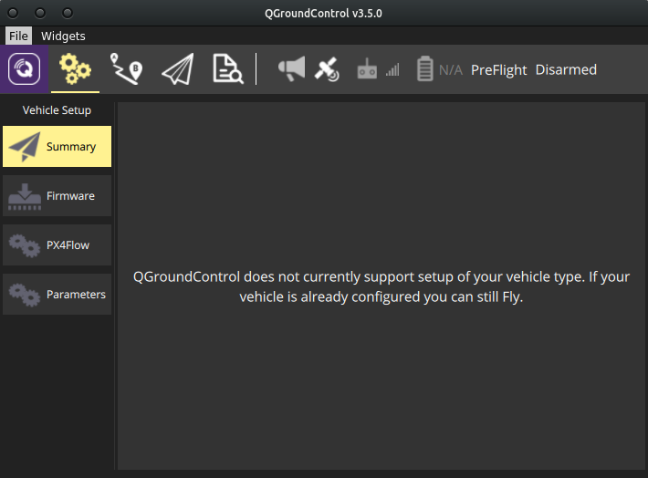
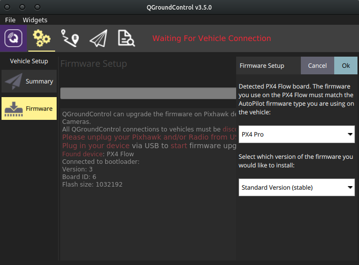
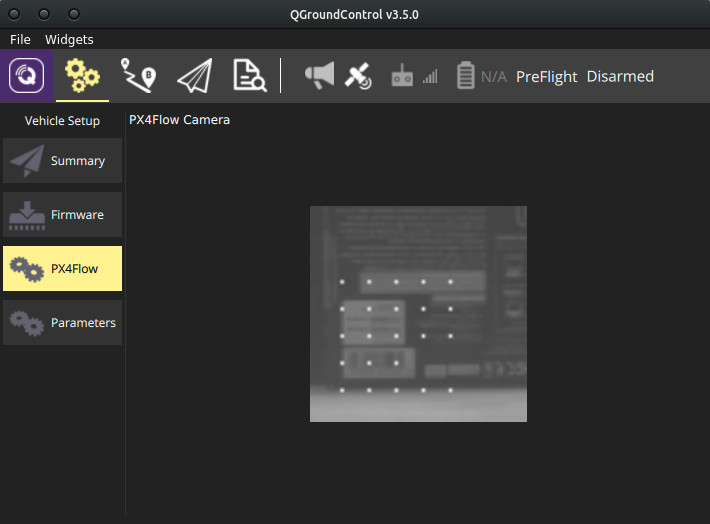
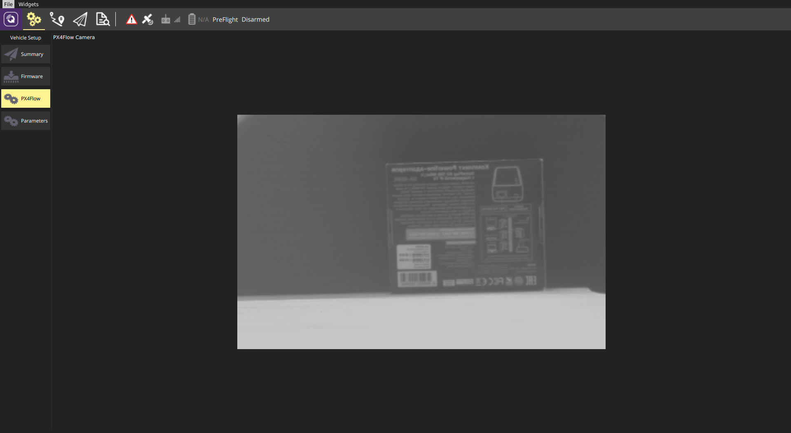
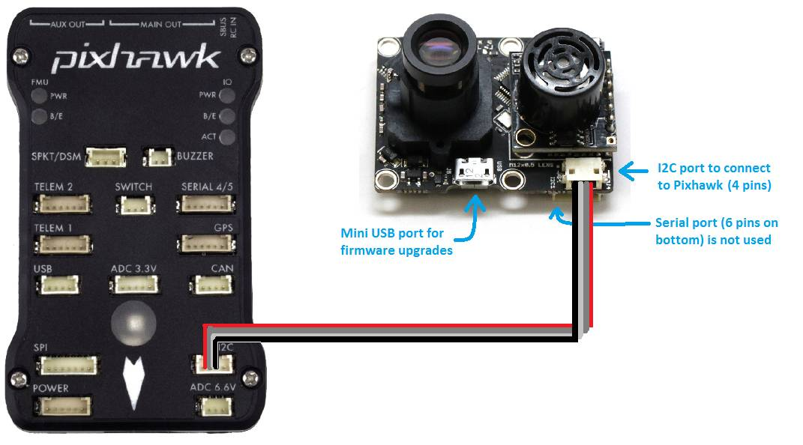
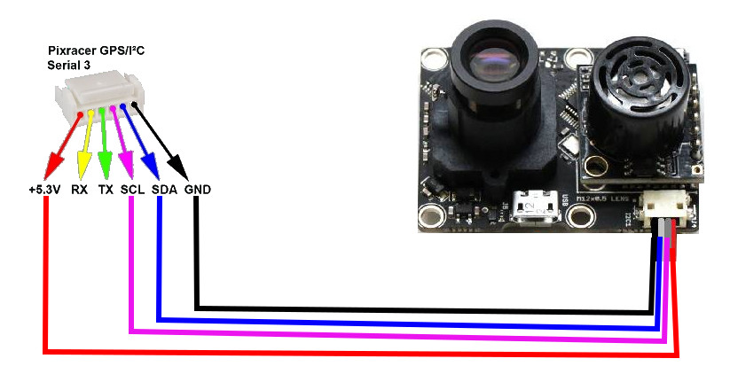

# Смарт-камера PX4FLOW

 

[PX4FLOW](https://docs.px4.io/en/sensor/px4flow.html) - смарт-камера, реализующая алгоритм вычисления "оптического потока" ([optical flow](https://docs.px4.io/en/sensor/optical_flow.html)) и способная передать полученные данные в полётный контроллер. Optical flow часто применяется для полётов коптера в помещении.

## Спецификации

Модуль PX4FLOW содержит:
* Микропроцессор Cortex M4F (168 MHz, 128 + 64 KB RAM)
* Светочувствительную матрицу MT9V034 (разрешение: 752x480 точек)
* Трёхосевой гироскоп L3GD20

Для светочувствительной матрицы используется объектив 16мм М12 с установленным ИК-фильтром.

Габариты модуля составляют 45.5x35 мм <!-- (TODO: высота?) -->

Модуль использует питание 5 В и потребляет до 115 мА.

Интерфейсы:
* USB (разъём microUSB) - используется для программирования и первоначальной настройки;
* I2c (разъём Hirose DF13 4 pos) - используется для передачи данных на полётный контроллер;
* USART2, USART3 (разъёмы Hirose DF13 6 pos) - могут использоваться для подключения к полётному контроллеру и последовательного соединения нескольких модулей.

> **Hint** Использование Optical Flow требует наличия дальномера!

На некоторых моделях PX4FLOW может быть установлен сонар Maxbotix LZ-EZ4. В этом случае его показания будут пересылаться вместе с показаниями камеры.

## Первоначальная настройка

Настройка камеры производится с помощью программы [QGroundControl](http://qgroundcontrol.com/). Запустите её и подключите модуль PX4FLOW к компьютеру по USB. Откройте режим `Vehicle setup` (иконка с шестерёнками); окно QGroundControl при этом будет выглядеть примерно так:

Если это первое включение камеры, то вам надо будет произвести [обновление её прошивки](firmware.md) по аналогии с перепрошивкой полётного контроллера.

> **Info** При перепрошивке PX4FLOW следует выбрать прошивку `PX4 Pro` при использовании полётного контроллера на базе `PX4` и `ArduPilot` при использовании полётного контроллера с прошивкой `ArduPilot`.

## Фокусировка камеры

Для оптимальной работы модуля PX4FLOW следует настроить фокус его камеры на предполагаемое расстояние от пола, при котором будут осуществляться полёты. Это можно сделать в QGroundControl в режиме `Vehicle setup` во вкладке `PX4Flow`. Там вы сможете увидеть изображение с камеры:

> **Hint** Для калибровки камеры лучше использовать специальный режим `Video only`. Для его включения зайдите во вкладку `Parameters`, найдите параметр `VIDEO_ONLY` и установите его в значение `1`

Фокусировку следует проводить в хорошо освещённом месте, модуль камеры при этом следует закрепить. Для фокусировки рекомендуется использовать книгу или коробку с текстом. Расположите объект, на котором вы будете фокусироваться, на таком расстоянии, на котором вы предполагаете летать над полом.

> **Info** В режиме калибровки камера будет выдавать изображение большего разрешения, чем при штатной работе, но с меньшей частотой кадров.

При работе в режиме калибровки рекомендуется развернуть окно QGroundControl на весь экран, чтобы лучше видеть изображение:

> **Hint** Изображение с камеры будет отражено по вертикальной оси. Это является нормальным поведением и не должно быть поводом для беспокойства.

Отпустите контргайку на объективе и медленно вращайте его, пока изображение не станет резким. После этого аккуратно закрепите объектив с помощью контргайки.

> **Info** Остальные параметры в данный момент не сохраняются, поэтому настройка камеры ограничивается её фокусировкой.

## Установка и подключение

По умолчанию предполагается, что модуль PX4FLOW будет расположен так, что направление оси `y` будет совпадать со стрелкой на полётном контроллере:

> **Hint** Поворот модуля PX4FLOW относительно полётного контроллера указывается параметром [`SENS_FLOW_ROT`](https://docs.px4.io/en/advanced_config/parameter_reference.html#SENS_FLOW_ROT) в PX4. Его значение по умолчанию (`Yaw 270°`) соответствует размещению на иллюстрации.

### Подключение к Pixhawk

Подключите PX4FLOW с помощью поставляемых кабелей к разъёму I2C на Pixhawk:

### Подключение к Pixracer

В полётном контроллере Pixracer используется совмещённый порт [UART/I2C](https://docs.px4.io/en/flight_controller/pixracer.html#pinouts) (помечен как GPS).

> **Warning** На более ранних версиях PX4FLOW разъём I2C может быть перевёрнут; ориентируйтесь на провод в комплекте - на нём красным отмечен провод питания.

> **Hint** Для подключения PX4FLOW к Pixracer рекомендуется использовать [GPS/I2C сплиттер](https://store.mrobotics.io/mRo-JST-GH-GPS-Port-to-I-C-Bus-Splitter-p/mro-jstgh-gps-i2c-split-mr.htm)

## Настройка полётного контроллера

Для того, чтобы полётный контроллер использовал данные с PX4FLOW, следует установить соответствующие флаги в настройках estimator'а:
* Для **LPE** (`SYS_MC_EST_GROUP` = `local_position_estimator`): в `LPE_FUSION` включены флажки `fuse optical flow` и `flow gyro compensation`
* Для **EKF2** (`SYS_MC_EST_GROUP` = `ekf2`): в `EKF_AID_MASK` включен флажок `use optical flow`

> **Hint** Остальные настройки PX4FLOW описаны в [статье по Optical Flow](optical_flow.md). Значения по умолчанию должны обеспечить оптимальную работу PX4FLOW.
