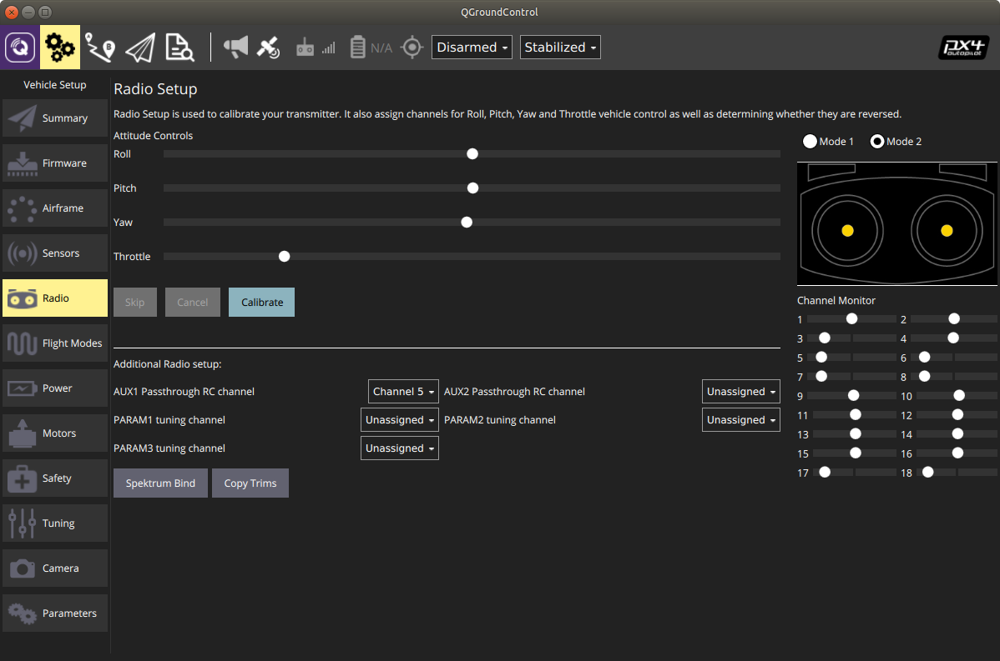

# Использование приёмника Flysky FS-A8S

Приёмник Flysky FS-A8S совместим с пультами Flysky FS-i6 и FS-i6x. Связь с полётным контроллером может происходить как с использованием аналогового протокола PPM, так и при помощи цифровых протоколов S.Bus/i-Bus.

Для подключения к полётному контроллеру рекомендуется использовать протокол S.Bus.

## Изготовление кабеля для подключения к полётному контроллеру

> **Note** Если в вашем наборе уже есть кабель для подключения приёмника к полётному контроллеру, совместимому с вашим, переходите к [следующему этапу](#rc_bind).

1. Аккуратно извлеките жёлтый провод из коннектора, идущего к приёмнику. Для того, чтобы вытащить провод, приподнимите острым пинцетом замок коннектора:

    

        
        
    

2. (При использовании полётного контроллера Pixracer) Извлеките 2 провода (зелёный и коричневый) из 5-пинового коннектора для полётного контроллера:

    

        
        
    

3. (При использовании полётного контроллера COEX Pix) Извлеките зелёный (или синий, в зависимости от комплектации) провод из 4-пинового коннектора для полётного контроллера:

    

        
        
    

4. С помощью бокорезов обрежьте концы кабелей с разъёмами Dupont (чёрными):

    

        
        
    

5. Зачистите и залудите 5-7 мм провода с каждой стороны:

    

6. Наденьте термоусадочные трубки на провода:

    

7. Спаяйте провода по следующей схеме:
    * чёрный провод приёмника с чёрным проводом кабеля полётного контроллера;
    * красный провод приёмника с красным проводом кабеля полётного контроллера;
    * белый провод приёмника с белым (при использовании Pixracer) или жёлтым (при использовании COEX Pix) проводом кабеля полётного контроллера:

    

8. Переместите термоусадочные трубки на места пайки и прогрейте их феном:

    

9. Скрутите готовые кабели:

    

С помощью изготовленного кабеля подключите приёмник к полётному контроллеру к порту RC IN:

    
    

> **Hint** Убедитесь, что провод, идущий в COEX Pix, подключен к порту RC IN:

## Сопряжение приёмника с пультом {#rc_bind}

Для сопряжения приёмника с пультом:

1. Убедитесь, что полётный контроллер выключен.
2. Зажмите кнопку **BIND** на приёмнике:

    

3. Включите полётный контроллер. Светодиод на приёмнике должен заморгать с высокой частотой.

    

4. Зажмите клавишу **BIND KEY** на пульте и включите его. На пульте должно появиться сообщение **RX Binding...**

    

5. Светодиод на приёмнике должен заморгать с низкой частотой.

    

6. Выключите и включите пульт. Светодиод на приёмнике должен перестать мограть.

    

> **Note** Данный приёмник не передаёт телеметрию обратно на пульт. Это значит, что на экране пульта не будет отображаться информация об уровне сигнала и напряжении на приёмнике. Эта особенность приёмника не является неисправностью и не влияет на управление.

## Выбор режима приёмника

Откройте QGroundControl и подключите полётный контроллер к компьютеру. Откройте вкладку Radio:

Если справа (под изображением пульта) не показано ни одного канала, зажмите кнопку **BIND** на приёмнике на 2 секунды. Должно появиться 18 каналов:

