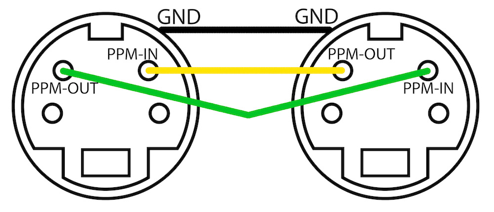

# Настройка режима тренера на пульте FlySky.

Режим тренера используют для обучения пилотированию. Чтобы во время обучения ученик ничего не повредил, на перехвате стоит опытный пилот, чтобы при необходимости взять управление на себя. 
Для этого при помощи провода соединяют два пульта: один из них - пульт тренера, а другой – ученика.

## Схема провода.

Для создания канала общения между пультами используется разъём сзади корпуса (S-Video).  Три контакта в разъёме отводятся для приёма, передачи информации и заземления. Контакт PPM-OUT (передача) должен быть соединён с PPM-IN (приём) и наоборот.  Во избежание помех внешней среды контакты ground должны быть соединены между собой. 
Таким образом нам нужно припаять провода к разъёму. 

## Настройка пульта Учителя.

Зайдите в настройки (зажмите кнопку OK). Далее зайдите в системные настройки (System setup) и найдите (Up/Down) режим тренера (Trainer mode). 

Активируйте режим:
Для этого в строке Mode должен стоять параметр On. Чтобы изменить параметр, используйте кнопки Up/Down. Чтобы сохранить параметр, нажмите OK.

Теперь выбираем переключатель для передачи управления:
Это можно сделать в меню режима (Trainer mode). В строке Switch выберите (менять можно с помощью Up/Down)  любую удобную клавишу (SwA, SwB, SwC, SwD). С помощью этой клавиши вы сможете перехватить управление. Убедитесь, что на эту клавишу не назначены другие функции.

Чтобы сохранить настройки зажмите Cancel.

> **Hint** На пульте учителя должен стоять тот же режим полёта, что и на пульте ученика.

## Настройка пульта Ученика.

Зайдите в настройки, System setup и выберите режим ученика (Student mode). Далее нажмите OK и при помощи Up/Down выберите подтверждение (Yes).
Зажмите Cancel, чтобы сохранить настройки.
Если всё настроено правильно, на главном экране появится буква S.
